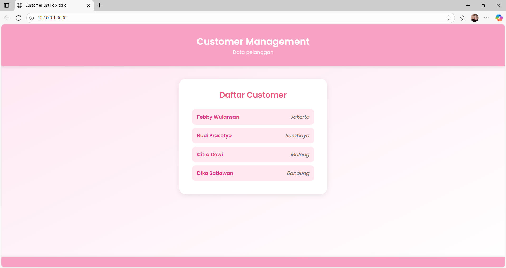

# 🌸 Express DB Toko

Project praktikum Node.js + Express + MySQL untuk menampilkan data pelanggan (`customers`) dari database `db_toko`.

## 📘 Deskripsi
Project ini menghubungkan server Express dengan database MySQL untuk mengambil data pelanggan dari tabel `customers`, yang memiliki kolom `cust_id`, `cust_name`, dan `cust_city`. Data ditampilkan ke pengguna menggunakan HTML, CSS, dan JavaScript.

## ⚙️ File Pendukung
- `index.js` → File utama server Express  
- `database_setup.sql` → Script untuk membuat database dan tabel pelanggan  
- Folder `public/` → Berisi file tampilan (`index.html`, `style.css`, `script.js`)

## 🛠️ Cara Menjalankan
1. Jalankan MySQL di XAMPP atau Laragon.
2. Buka phpMyAdmin → jalankan script `database_setup.sql` untuk membuat database.
3. Jalankan server:
   ```bash
   node index.js

## 🖼️ Tampilan Aplikasi
Berikut adalah tampilan halaman daftar pelanggan yang diambil dari database:


